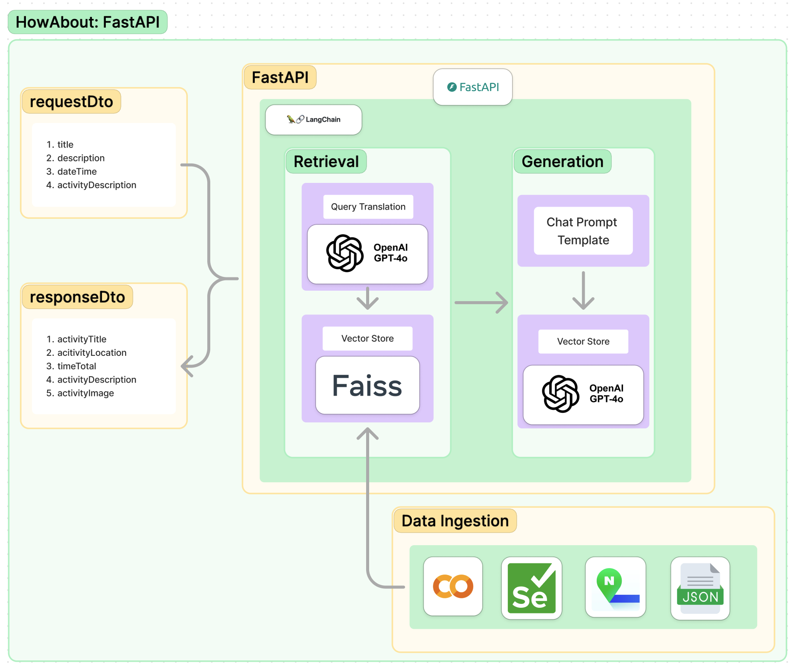

# RAG

## Repository Structure

```bash
RAG/
├── rag-practice/
│   ├── mvp-rag-db/
│   │   └── mvp_rag_db.ipynb: Manual Vector Store Creation
│   ├── rag-langchain/
│   │   ├── RAG_application_mvp.ipynb: MVP RAG using langchain
│   │   ├── RAG_application_mvp_query_analysis.ipynb: RAG Application with Query Translation
│   │   └── RAG_application_mvp_query_analysis_prompt_langchain.ipynb: RAG Application with Vector Store and Prompt for generation
│   ├── rag-mvp/
│   │   └── rag_practice_mvp.ipynb: MVP RAG using chroma db
│   └── rag-vector-db-langchain: RAG Data Ingestion/
│       ├── rag_vec_db_langchain.ipynb: Turning FAISS vector store using langchain
│       └── json_preprocessing.ipynb: Preprocessing unecessary data
└── rag-service/
    └── rag-api-server: RAG Application applied to a server
```

## RAG Practice

[`rag-practice/rag-mvp/rag_practice_mvp.ipynb`](https://github.com/jwywoo/RAG/blob/main/rag-practice/rag-mvp/rag_practice_mvp.ipynb): MVP RAG Application using langchain and ChromaDB


[`rag-practice/rag-langchain/RAG_application_mvp.ipynb`](https://github.com/jwywoo/RAG/blob/main/rag-practice/rag-langchain/RAG_application_mvp.ipynb): Replacing ChromaDB to Faiss


[`rag-practice/rag-langchain/RAG_application_mvp_query_analysis.ipynb`](https://github.com/jwywoo/RAG/blob/main/rag-practice/rag-langchain/RAG_application_mvp_query_analysis.ipynb): Add Query Translation for Retrieving


[`rag-practice/rag-langchain/RAG_application_mvp_query_analysis_prompt_langchain.ipynb`](https://github.com/jwywoo/RAG/blob/main/rag-practice/rag-langchain/RAG_application_mvp_query_analysis_prompt_langhcain.ipynb): Add Prompt for specified generation


## RAG Service

[`rag-service/rag-api-server`](https://github.com/jwywoo/RAG/tree/main/rag-service/rag-api-server): Turning final RAG Application to API Server



