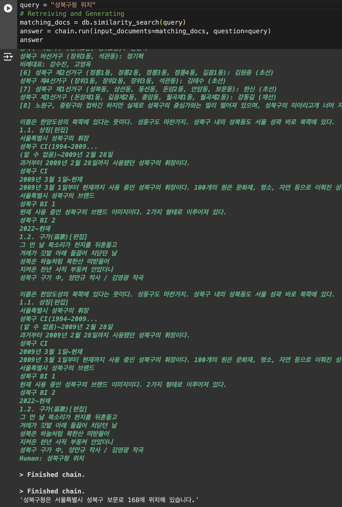

# MVP RAG Implementation
## Used Packages
- openai
- langchain
- unstructured
- chromadb
- sentence_transformers

Check `requirements.txt` for detail

## Logic

- Dataset Prep

    - chunked raw data

    - store chucked data to Vector DB(Chroma)

- Retrieving & Generating

    - LLM -> `gpt-3.5-turbo`

    - chain -> Q&A: Query + Selected Data from db will be passed to LLM `.similarity_search(query)`

## Result

